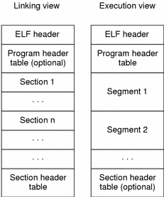

# NeronomiCC (*ncc*)
### *All for DOOM* Now with x86_64 ###
Thanks author for translation. He lost his mind during elf battle, but task is done
## Basic ##
+ Only latin. Only hardcore.
+ Case insensitive. Good luck in naming.
+ All retunrs. Any action will affect your destiny.

## Syntax and **keywords** ##
 
+ Cat is supreme god. *Fall beneath Its will*. So with *first* **meow** It proclaims what everyone must stop all their shallow tasks and listen to It. And *second* **meow** allows foolish mortals to fall in depth of routine.

+ Point. Point to point and point in point that points to point. Use point to point to keywords.

+ ' is comment to next ' or non-letter synbol. So allow your madness to free like bird in sky.

+ ### Number format ###
    - **zhro** is zhor. So nothing and means.
    - **Dagon** is one.
    - **Blahaj** is better than you think. And it's reverse gives six.
+ ### Basics of arithm ###
    - With every **ah** overhaul chaos increases.
    - If you wanna be less, duck down under **-**.
    - What are you doing in silence? **ch**shhh - multiplying silence to listen to Ancients.
    - Take axe **d**own to divide everything apart. For the glory of course.
    - In what mood are you? M-mm-m-mm-m-mm-**md**-mad? Ok, stay here in your module.
    - **goka**! Goka and goka, what it changes?
    - What is you destiny white walls o**r**  what do you hope on?
    - What bitwise Santa says?: Xor-**xor**-xor
    - It'sssss co**llll**d on llleft ssside off rrroom.
    - Go **nafl** from it!
+ Every pronounced **fhtagn** sets the one piece on creation.
+ ### LoGic WoN'T hElP yOu ###
    - Listen to what **role** is meant to you.
    - Do you believe that **Earth** is flat? Go to the end of your land.
+ ### A lot of UncOmparable ###
    - Eq. **eq**. eq. Every is equal before Ancient fear.
    - But iq, jq, kq, lq, **nq**. Is different.
    - My name iiiiis **lprimo**.
    - Be **gr**8 that you are.
    - Downer in **lqst**.
    - **grrr** > grrr = grrr.
+ ### Lone warrior in field ###    
    - **nog** Enough said.
    - **isc**hem smisl. Ego net.
    - Despicable **dh**'oine.    
+ ### And with this song we proclaim ... ###
    - **Shoggoth** is small 8-legged beast.
    - **Great** man can do great things. Possibly recursively.
    - What do you use to write **comma**nds.
    - And the one thing to **call** them all (o).
+ ### Divide and rule ###
    - Nothing is better dividor that unexpected **.**
    - QQ **;**
    - And **Azathoth** asks you **:** are you really?
+ ### Hell ring ###
    - **Nyarlathotep**ped, Nyarlathotepped, Nyarlathotepped, Nyarlathotep...
+ ### What is way to hospital ###
    - If one asked address, how many pepole aswers **?**
    - S#%k up **!** And take your data.
+ **Cthulhu** is main difference.

# X86_64 or Great war with elfs #
x86_64 5000 times faster than execuing in virtual prc

For executing in x86_64 mode you must add ncclib.so to your ld path.

 `export LD_LIBRARY_PATH=./ncc:$LD_LIBRARY_PATH`

 or just cp (ln) ncc/libncc.so to /lib64

 `cp ncc/libncc.so /lib64`

 ## How? ##

 Our goal is to generate elf file during backend.
 Let's start with elf general structure.

 

 So we need to fill all this fields.
 We will use elf.h for structure templates.

 ### ELF Header ###

 Elf header is first part of elf file. 

``` c
const Elf64_Ehdr EHdr{
    .e_ident = {                            
        ELFMAG0, ELFMAG1, ELFMAG2, ELFMAG3,     // 0x7f 'E' 'L' 'F'  -> File Signature
        /*[EI_CLASS     ] = */ ELFCLASS64,      // Type 32/64 bit system
        /*[EI_DATA      ] = */ ELFDATA2LSB,     // LittleEndian / BigEndian
        /*[EI_VERSION   ] = */ EV_CURRENT,      // Magic constant.
        /*[EI_OSABI     ] = */ ELFOSABI_NONE,   // Non specified system
        /*[EI_ABIVERSION] = */ 0,               
        0,0,0,0, 0,0,0                          // Fill with 0
    },
    .e_type    = ET_EXEC,                       // Type: executable
    .e_machine = EM_X86_64,                     // Machine type: amd x86_64
    .e_version = EV_CURRENT,                    // Magic constant.

    .e_entry     = 0x1030,                      // Entry point of programm.

    .e_phoff     = sizeof(Elf64_Ehdr),          // Offset of programm header table. We took size of elf header
    .e_shoff     = 0x3500,                      // Offset of segment header table. For example 0x3500.

    .e_flags     = 0,                           // Extra flags: no flags
    .e_ehsize    = sizeof(Elf64_Ehdr),	        // Size of this header.

    .e_phentsize = sizeof(Elf64_Phdr),          // Size of Programm header table entry. 
    .e_phnum     = 6,                           // Number of pheader entries. 

    .e_shentsize = sizeof(Elf64_Shdr),          // Size of Segment header entry.
    .e_shnum     = 11,                          // Number of segments in programm.
    .e_shstrndx  = 3,                           // Index of string table. (Explained in further parts).
}; 
```
### Programm Header ###
The second part is ProgrammHeader (Pheader). It shows how parts of file should be loaded (offset in virtual address, rights of segmnets).
Struct of table entry is (we took text segment for example): 
```c
Elf64_Phdr hdr_text = {
        .p_type   = PT_LOAD,	            // We load this segment
        .p_flags  = PF_R | PF_X,		    // (R)ead + e(X)ecute
        .p_offset = 0x1000,		            // Offset of data in file
        .p_vaddr  = StartOff + 0x1000,	    // Virutual address to copy to
        .p_paddr  = StartOff + 0x1000,		// Physical address (if virtual not supported)
        .p_filesz = binSz + PltSz,		    // Real size of data
        .p_memsz  = binSz + PltSz,		    // Size after loading (usually the same as real)
        .p_align  = 0x1000,                 // Aligin of this segment
    };
```

We have next segments in our programm

1. Programm header itself.                          (R--)
2. String, showing name of linker to be used to.    (R--)
3. Filler. (R--)
4. Text (binary code).  (R-X) 
5. Dynamic load segment. (RW-)
6. Same as 5 but with other p_type. (RW-)

### Section header ###

The next to fill is section header. We will put it to the end of elf file.
It contains information about section - logical parts of our file, they decribe what information is stored.

Section header entry looks like: 

```c
    {   
        .sh_name      = 44,              // Offset to name in string table (will be explained further)
        .sh_type      = SHT_PROGBITS,    // Type of information. PROGBITS - programm data.
        .sh_flags     = SHF_ALLOC,       // Flags. SHF_ALLOC - memory is allocated.
        .sh_addr      = 0x400200,        // Virtual adress
        .sh_offset    = 0x200,           // Offset in file
        .sh_size      = sizeof(Interp),  // Size of section
        .sh_link      = 0,               // Index of linked section.
        .sh_info      = 0,               // Index of section with information.
        .sh_addralign = 0x8,             // Alligin of adress
        .sh_entsize   = 0,               // Entry size. Neccesary for some sections.
    },
```

We have 9 sections.

0. Null filler.
1. Name of interpreter - name of dynamic linker to be used.
0. Dynamic linker symbol table.
0. String table - just some 0-ended strings (e.g. section names) used in this file.
0. .rela.plt - section for dynamic linkage. Keeps info of names to be linked.
0. .plt - section for dynamic linkage. Keeps binary code for linkage.
0. .text - section for binary code of programm.
0. .dynamic - section for dynamic linker data.
0. .got.plt: - section to recieve dynamic links.

### .rela.plt ###

```c
static Elf64_Rela RelaSeg[2] = {
    {                                                    // ncc_in
        .r_offset = 0x403018,                            // Offset of place to put dynamic info.
        .r_info   = ELF64_R_INFO(1, R_X86_64_JUMP_SLOT), // Type of linkage - 64bit jump slot.
        .r_addend = 0,                                   // Nothing add to end.
    },
    {                                                    //ncc_out
        .r_offset = 0x403020,                            
        .r_info   = ELF64_R_INFO(2, R_X86_64_JUMP_SLOT),
        .r_addend = 0,
    }
};
```

...WIP